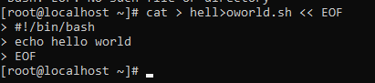
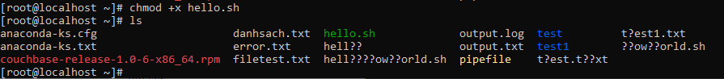
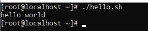
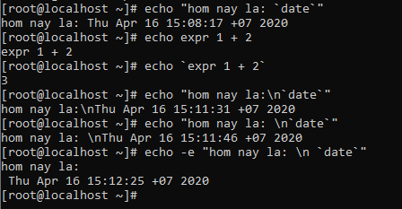
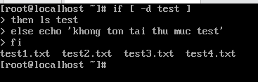
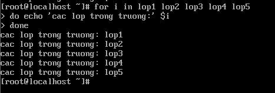

## Shell script
### 1.Script là gì? (https://viblo.asia/p/dinh-nghia-co-ban-ve-script-Q7eEREBgMgNj)
- Script là mã kịch bản hay bản thảo được viết theo ngôn ngữ máy.
- Script là một loại chương trình của máy tính, sẽ tự động hóa hoặc lược bỏ quy trình tạo file có khả năng chạy hoặc biến đổi đến ngôn ngữ máy tính.
- Script có thể chạy ngay khi bạn viết source code và ngôn ngữ script chính là ngôn ngữ lập trình mà có thể chạy chương trình đó.

### 2.Shell script là gì? (https://quantrimang.com/shell-la-gi-156606, https://blogd.net/linux/lap-trinh-bash-shell-sieu-co-ban/)
- Shell là một môi trường cho phép các câu lệnh, các chương trình và các shell script chạy trên đó.
- Shell script là một danh sách các lệnh được liệt kê theo thứ tự thi hành. Và khi thực hiện lệnh ta chỉ cần chạy file script đó để có thế thực hiện các lệnh có trong file theo trình tự.
- Tiện ích của shell script:
<ul>
	<li>Shell script có thể nhận đầu vào từ người dùng, tệp hoặc kết quả từ màn hình</li>
	<li>Giúp cho chúng ta tạo nhóm lệnh riêng</li>
	<li>Giúp cho chúng ta tiết kiệm thời gian</li>
	<li>Có khả năng thực hiện tự động các công việc mà ta thường xuyên phải làm trên máy tính</li>
</ul>
- File shell script trong linux thường có định dạng đuôi là *tênfile.sh*
- Trong nội dung của một file shell script, dòng đầu tiên của file đó luôn bắt đầu với một `shebang`:
`#!/bin/bash`
- Thực thi một file shell ta có thể chạy bằng một số cách:
<ul>
	<li>Sử dụng lệnh bash: bash tên_file.sh</li>
	<li>Sử dụng lệnh sh: sh tên_file.sh</li>
	<li>Sử dụng quyền thực thi: ta phải cấp quyền thực thi cho file bằng lệnh chmod sau đó thực hiện chạy quyền thực thi: ./tên_file.sh</li>
</ul>

### 3.Shell script hello world (https://bash.cyberciti.biz/)
- Tạo file với đuôi file `.sh`


- Sau khi tạo file, ta cấp quyền thực thi cho file đó để có thể khởi chạy bằng quyền `chmod +x`.


- Chạy file shell script vừa tạo để hiển thị kết quả ra màn hình


### 4.Biến trong shell (https://viblo.asia/p/tim-hieu-lap-trinh-shell-linux-p1-wjAM7ydbvmWe)
- Biến hệ thống: là các biến được tạo ra và quản lí bởi linux, các biến này có tên được viết chữ in hoa.
- Biến người dùng đặt: là các biến được tạo ra và quản lí bởi người dùng và thường viết bằng chữ thường.
- Một số quy tắc tạo biến người dùng:
<ul>
	<li>Cú pháp: tên_biến=value</li>
	<li>Tên biến phải bắt đầu bằng kí tự và không có dấu cách ở 2 đầu toán tử = khi gán giá trị cho biến</li>
	<li>Tên biến có phân biệt chữ hoa chữ thường</li>
	<li>Không được sử dụng dấu ?,\* để đặt tên cho các biến</li>
	<li>Đối với một biến không có giá trị khởi tạo thì biến đó bằng NULL</li>
</ul>
- Shell script cũng cung cấp một số các phép toán số học với cú pháp: `expr toán_hạng_1 toán_tử toán_hạng_2`. Chú ý phải có dấu cách ở trước và sau toán tử thì mới được coi là một cú pháp đúng. Ví dụ
```
# Phép cộng: expr 1 + 2
# Phép trừ: expr 5 - 1
# Phép chia: expr 8 / 3 (phép chia lấy phần nguyên) hoặc expr 8 % 3 (phép chia lấy phần dư)
# Phép nhân: 10 * 2
```
- Các kí tự ở trong dấu ngoặc kép đều không có ý nghĩa tính toán trừ những kí tự \ hoặc $. Còn đối với dấu nháy ngược \` thì sẽ được yêu cầu thực thi. Ví dụ:


### 5.Lệnh test
- Lệnh test được dùng để kiểm tra một biểu thức đúng hay sai và trả lại kết quả.
- Cú pháp: `test biểu_thức` hoặc `[biểu_thức]`
- Một số phép toán kiểm tra:

| Phép toán |  Ý nghĩa  | kí hiệu toán học | Cú pháp |
|-----------|-----------|------------------|---------|
| -eq | bằng | == | if test 5 -eq 6 hoặc if [5 -eq 6] |
| -ne | không bằng | != | if test 5 -ne 6 hoặc if [5 -ne 6] |
| -lt | nhỏ hơn | < | if test 5 -lt 6 hoặc if [5 -ne 6] |
| -le | nhỏ hơn hoặc bằng | <= | if test 5 -le 6 hoặc if [5 -le 6] |
| -gt | lớn hơn | > | if test 5 -gt 6 hoặc if [5 -gt 6] |
| -ge | lớn hơn hoặc bằng | >= | if test 5 -ge 6 hoặc if [5 -ge 6] |

- Một số kiểm tra file và thư mục:

|   Lệnh  |   Ý nghĩa  |
|---------|------------|
| -s file | Kiểm tra có phải nó là một file không phải file trống |
| -f file | Kiểm tra file có tồn tại hay không hoặc nó có phải là một file bình thường hay không phải là một thư mục |
| -d dir | Kiểm tra xem thư mục đó có tồn tại hay không hoặc nó không phải là một file |
| -w file | Kiểm tra file có được cấp quyền write hay không |
| -r file | Kiểm tra file có được cấp quyền read hay không |
| -x file | Kiểm tra file có được cấp quyền execute hay không |

- Kiểm tra đối với string:

| Lệnh |   Ý nghĩa   |
|------|-------------|
| string1 = string2 | chuỗi 1 bằng chuỗi 2 |
| string1 != string2 | chuỗi 1 không bằng chuỗi 2 |
| string 1 | chuỗi 1 có giá trị khác NULL hoặc không tồn tại |
| -n string1 | chuỗi có giá trị khác NULL và tồn tại |
| -z string1 | chuỗi có giá trị NULL và tồn tại |

- Toán tử logic:

|     Lệnh     | Ý nghĩa |
|--------------|---------|
| !đối_tượng | NOT |
| đối_tượng_1,-a,đối_tượng_2 | AND |
| đối_tượng_1,-o,đối_tượng_2 | OR |

### 6.Cấu trúc điều khiển trong shell script
#### 6.1.Rẽ nhánh *if*
- Cú pháp: if *điều_kiện* then *câu_lệnh_1 ...* fi
- Hơặc cú pháp: if *điều_kiện*then *câu_lệnh_1 ...* else *câu_lệnh_2* fi
- Cú pháp rẽ nhánh được dùng để kiểm tra điều kiện khi được thỏa mãn sẽ thực hiện câu_lệnh_1 còn khi điều không thỏa mãn sẽ thực hiện câu_lệnh_2
- Ví dụ:


#### 6.2.Vòng lặp *for*
- Cú pháp for *tên_biến* in *danh_sách* do *khối_lệnh* done
- Hoặc cú pháp for (( *điều_kiện_1*; *điều_kiện_2*; *...; điều_kiện_n*)) do *khối_lệnh* done
- Vòng lặp sẽ thực hiện các lệnh trong khối cho đến khi điều kiện hoặc các biến đều được trả về giá trị true khi thực hiện các lệnh.
- Ví dụ: 


### 7.Tham khảo
- Một số shell script nâng cao (Master): http://bash.cyberciti.biz
- https://viblo.asia/p/dinh-nghia-co-ban-ve-script-Q7eEREBgMgNj
- https://quantrimang.com/shell-la-gi-156606
- https://blogd.net/linux/lap-trinh-bash-shell-sieu-co-ban/
- https://viblo.asia/p/tim-hieu-lap-trinh-shell-linux-p1-wjAM7ydbvmWe
