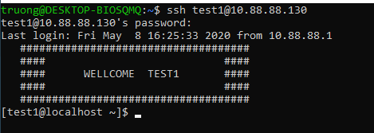

## Local user management

### 1.Giới thiệu về người dùng (http://estih.edu.vn/wp-content/uploads/2017/08/Quan_ly_User.pdf)
#### 1.1.Người dùng là gì? (https://support.maxserver.com/767313--H%C6%B0%E1%BB%9Bng-d%E1%BA%ABn-qu%E1%BA%A3n-l%C3%BD-User-v%C3%A0-Group-tr%C3%AAn-Linux, https://gocit.vn/bai-viet/quan-ly-user-group-va-phan-quyen-tren-linux/)
- User là một thuật ngữ chuyên dụng được sử dụng trong ngành công nghệ thông tin. User được dùng để thể hiện tài khoản của người dùng trong máy tính. User giúp bạn bảo mật thông tin máy tính của bạn. User được sử dụng để login, gán quyền ... Mỗi user còn có một mã định danh riêng gọi là UID. Định danh của người dùng bình thường sử dụng giá trị bắt đầu từ 500.
- Group là thuật ngữ chỉ 1 nhóm tập hợp của nhiều user lại với nhau ,Mỗi user trên linux bắt buộc phải thuộc một group chính (gọi là Primary Group), ngoài ra còn có thể lựa chọn tham gia vào các group khác (gọi là Secondary Group). Mỗi group cũng có một mã định danh riêng gọi là GID. Định danh của group thường được sử dụng giá trị bắt đầu từ 500.

#### 1.2.Phân loại user (https://quantrimang.com/quan-ly-nguoi-dung-trong-unix-linux-157651)
- Superuser: (user gốc) là user có sự điều khiển tuyệt đối tới hệ thống. Một superuser có thể chạy bất kì lệnh nào mà không bị hạn chế. Superuser được coi như là một quản lý hệ thống.
- usersystem: (user hệ thống) là các user được sử dụng cho các hoạt động riêng trong hệ thống như các tài khoản mail, tài khoản sshd. Các user này thường cần cho một số chức năng riêng và nếu có sự thay đổi nào từ chúng cũng sẽ có ảnh hưởng đến dịch vụ của hệ thống.
- regular user: (user thường) là user cung cấp sự truy cập mang tính tương tác tới hệ thống với người dùng và nhóm sử dụng. Các user này thường bị giới hạn truy cập vào những file và thư mục có tính chất quan trọng.

### 2.Quản lí user
#### 2.1.Một số command (https://quantrimang.com/kiem-tra-user-hien-tai-tren-linux-162969, https://cuongquach.com/tim-hieu-khac-biet-su-va-su-minus-linux.html, https://techmaster.vn/posts/34146/co-gi-khac-biet-giua-sudo-va-su-trong-linux)

| Lệnh |    Ý nghĩa    |
|------|---------------|
| whoami | Dùng để cung cấp tên của user hiện tại |
| who | Dùng để cung cấp tên của user hiện tại, thời gian đăng nhập và thiết bị đầu cuối user đăng nhập |
| w | Dùng để cung cấp bộ dữ liệu của user bao gồm tên, loại thiết bị đầu cuối, thời gian login, tên máy chủ từ xa nếu đây là một kết nối từ xa ... |
| id | Cung cấp UID, GID và các nhóm mà user đang là thành viên |
| su | Dùng kết hợp với *username* thì sẽ thực hiện mở một shell mới với quyền của user đó nhưng sẽ không có sự áp dụng các biến môi trường được quy định đối với user đó. |
| su - | Dùng với *username* thì sẽ thực hiện mở shell mới với quyền của user đó nhưng lúc này các biến môi trường được quy định với user đó sẽ được áp dụng đối với shell mới này |
| sudo | Cho phép người dùng có thể sử dụng tài khoản của họ chạy các câu lệnh hệ thống |
| visudo | Dùng để mở chỉnh sửa file */etc/sudoers* |

#### 2.2.File /etc/passwd (https://vinasupport.com/quan-ly-user-group-tren-linux-bang-command-line/, https://blogd.net/linux/quan-ly-nguoi-dung-va-nhom-tren-linux/)
- File /etc/passwd là nơi lưu trữ danh sách và thông tin của các user trong hệ thống.

- Tại đây, thôn tin của 1 user sẽ được thể hiện qua các trường:
`***username:x:UID:GID:comment:Home directory:Default shell***`

#### 2.3.Command useradd và file cấu hình /etc/default/useradd
- Command useradd được dùng để tiến hành tạo user cá nhân và thêm vào hệ thống.
- Cú pháp: `useradd [option] <username>`

- Như ví dụ trên ta tạo user với tên *test1*. Sau khi tạo, ta kiểm tra trong file */etc/passwd* thấy có user *test1* đã được tạo với UID=1000, GID=1000, mô tả thông tin về user, thư mục home được tạo với tên mặc định giống với tên user.

- File /etc/default/useradd là file chứa cấu hình tạo user của hệ thống, ta có thể xem và chỉnh sửa cấu hình tạo user tại file này.

#### 2.4.Command usermod và userdel
- usermod là command được dùng để thay đổi thông tin của user như thay đổi mô tả, thay đổi nhóm của user, thay đổi thư mục home của user ...

	Ví dụ trên ta đã thay đổi group của user test1 sang group couchbase.

- userdel là command được dùng để xóa user. Sử dụng thêm option `-r` để tiến hành xóa cả thư mục home của user.

#### 2.5.File /etc/skel (https://viblo.asia/p/quan-ly-cac-users-trong-ubuntu-server-p1-lxrzXNApReO)
- File */etc/skel* là file chứa các cấu hình mặc định dành cho một nhóm user nào đó.
Trong thư mục đó sẽ chứa các file cấu hình ẩn như: `.bashrc, .bashrc_profile, ., ..`

- Các file cấu hình đó sẽ được mặc định copy thêm vào thư mục home của user mới khi user đó được tạo.

#### 2.6.User login shell (https://cuongquach.com/su-khac-nhau-giua-login-shell-va-non-login-shell-trong-linux.html)
- Một login shell được khởi tạo sau khi một user login thành công vào hệ thống từ terminal ssh hoặc console. Login shell là tiến trình đầu tiên được thực thi với user ID khi tạo một session mới. Tiến trình login shell sẽ có thêm một dấu gạch ngang ở phía trước để phân biệt và thường bash shell của một shell login sẽ là /bin/bash.

- Một non-login shell được bắt đầu bởi các chương trình như script hay dịch vụ của linux mà không cần phải login tài khoản user. Để phân biệt thì thường một non-login shell sẽ không có dấu gạch ngang ở phía trước và bash shell sẽ là /sbin/nologin

### 3.Quản lí password user
#### 3.1.Command passwd, chpasswd (https://www.geeksforgeeks.org/chpasswd-command-in-linux-with-examples/, https://gocit.vn/bai-viet/tao-va-quan-ly-user-linux/)
- Command *passwd* và *chpasswd* được sử dụng để tạo hoặc thay đổi mật khẩu cho các user trong hệ thống linux.
- Command *passwd* chỉ có thể đặt hoặc thay đổi mật khẩu của một user tại một thời điểm. Trong khi đó *chpasswd* có thể tạo hoặc thay đổi mật khẩu cho nhiều user tại một thời điểm.
- Ví dụ:

- Command *chpasswd* có thể đọc dữ liệu thông tin đầu vào bằng các nhập trực tiếp hoặc đọc từ một file chứa thông tin username và password. Thông tin về username và password trong lệnh *chpasswd* đươc ngăn cách với nhau bởi dấu `:`
- Thông thường password trong lệnh *chpasswd* sẽ không được mã hóa mà sẽ ở dạng clear text. Vì thế để mã hóa password sau khi tạo hoặc đổi ta phải sử dụng thêm các option:
	<ul>
		<li> -c method name: mã hóa theo các kiểu mã hóa dữ liệu</li>
		<li> -e: sử dụng kiểu mã hóa được linux cung cấp</li>
		<li> -m: sử dụng kiểu mã hóa MD5</li>
		<li> -s: cung cấp số lượng vòng lặp cho kiểu mã hóa SHA</li>
	</ul>
- Ví dụ:

#### 3.2.File /etc/shadow (https://blogd.net/linux/quan-ly-nguoi-dung-va-nhom-tren-linux/)
- File */etc/shadow* là nơi lưu trữ mật khẩu của người dùng hệ thống giống như file */etc/passwd*. Tuy nhiên, file */etc/shadow* có tính bảo mật cao hơn do chỉ có người dùng root hoặc quyền sudo mới có thể truy cập vào nội dung của file.
- Thông tin mà file /etc/shadow được lưu thành các trường
	<ul>
		<li>Trường thứ 1: username</li>
		<li>Trường thứ 2: password của user đã được mã hóa</li>
		<li>Trường thứ 3: khoảng thời gian (bằng ngày) tính từ 1/1/1970 cho tới lần cuối đổi mật khẩu</li>
		<li>Trường thứ 4: thời gian tối đa còn cho phép người dùng đổi mật khẩu. Nếu là số 0 thì user có thể đổi mật khẩu bất cứ lúc nào.</li>
		<li>Trường thứ 5: thời gian hiệu lực tối đa của password, nếu là 99999 thì có nghĩa mật khẩu có hiệu lực vô hạn</li>
		<li>Trường thứ 6: khoảng thời gian trước khi mật khẩu hết hạn</li>
		<li>Trường thứ 7: khoảng thời gian tài khoản hết hạn đăng nhập</li>
		<li>Trường thứ 8: thời gian mà tài khoản đã hết hạn tính từ ngày 1/1/1970</li>
	</ul>

#### 3.3.Mã hóa mật khẩu (https://securitydaily.net/tim-hieu-cach-luu-tru-mat-khau-nguoi-dung-tren-linux/, https://blogd.net/linux/ma-hoa-giai-ma-va-bao-ve-bang-mat-khau-tap-tin-tren-linux/, https://cuongquach.com/dat-matkhau-file-zip-tren-linux.html)
- Mã hóa mật khẩu được sử dụng để đảm bảo cho mật khẩu được an toàn hơn. Mã hóa mật khẩu thường được sử dụng các kiểu mã hóa khác nhau như MD5, SHA ....
- Để mã hóa một mật khẩu cho user trong linux thì đơn giản nhất ta sử dụng lệnh *passwd* để tạo và mã hóa mật khẩu cho user.

#### 3.4.File /etc/login.def (https://www.thegeekdiary.com/understanding-etclogin-defs-file/, http://hungdc-nd.blogspot.com/2016/04/file-etc-logindefs-va-thu-muc-etc-skel.html)
- File */etc/login.defs* cung cấp thông tin cấu hình mặc định cho từ tham số cấu hình của mỗi user.
- Tất cả các lệnh `useradd, usermod, userdel, groupadd ...` đều lấy giá trị mặc định từ file này.
- File */etc/login.defs* chứa các thông tin mặc định khi tạo mới 1 user:
	<ul>
		<li>MAIL_DIR: thư mục mail của một user</li>
		<li>PASS_MAX_DAYS: số ngày nhiều nhất mà mật khẩu có hiệu lựu</li>
		<li>PASS_MIN_DAYS: số ngày ít nhất mà mật khẩu có hiệu lực</li>
		<li>PASS_MIN_LEN: độ dài tối thiểu của mật khẩu</li>
		<li>PASS_WARN_AGE: số ngày bắt đầu cảnh báo trước khi mật khẩu hết hiệu lực</li>
		<li>UID_MIN: số UID nhỏ nhất mà user tự gán khi mới khởi tạo mặc định</li>
		<li>UID_MAX: số UID lớn nhất mà user tự gán khi mới khởi tạo mặc định</li>
		<li>GID_MIN: số GID nhỏ nhất tự gán khi tạo group mặc định</li>
		<li>GID_MAX: số GID lớn nhất tự gán khi tạo group mặc định</li>
		<li>CREATE_HOME: có hoặc không tạo thư mục home cho user</li>
		<li>UMASK: umask cho user</li>
		<li>USERGROUPS_ENAB: có hoặc không xóa group nếu user không tồn tại</li>
		<li>MD5_CRYPT_ENAB: sử dụng mã hóa MD5 để mã hõa mật khẩu</li>
	</ul>
- Để thay đổi thời hạn của password ta sử dụng lệnh *chage [option]*
	<ul>
		<li>-m (mindays): Minimum days</li>
		<li>-M (maxdays): Maximum days</li>
		<li>-d (lastdays): Day last changed</li>
		<li>-I (inactive): Inactive lock, sau khi mật khẩu hết hạn bao lâu sẽ lock tài khoản.</li>
		<li>-E (expiredate): Expiration (YYYY-MM-DD or MM/DD/YY)</li>
		<li>-W (warndays): Warning days</li>
	</ul>

#### 3.5.Banner login (https://techblog.vn/tuy-bien-messages-khi-ban-mo-terminal-tren-ubuntu-sao-cho-dep-va-doc)
- Banner login dùng để tạo một thông báo khi người dùng đăng nhập vào tài khoản hệ thống bằng console hoặc ssh.
- Để thay đổi banner cho một user khi đăng nhập vào ta sẽ tiến hành chỉnh sửa thông tin đó trong file *.bashrc* tại thư mục home của các user.

- Sau khi lưu lại thay đổi ta tiến hành đăng nhập thử vào hệ thống để xem kết quả

### 4.Quản lí group
#### 4.1.Một số command sử dụng để quản lí group (https://quantrimang.com/quan-ly-nguoi-dung-trong-unix-linux-157651, https://help.tino.org/huong-dan/quan-tri-users-and-groups-tren-linux/)
- *groupadd* dùng để tạo một hoặc nhiều group mới.
- *groupdel* dùng để xóa group đã tạo.
- *groupmod* dùng để chỉnh sửa thuộc tính các group.
- *gpasswd* dùng để tạo password cho group hoặc ủy quyền cho user quản lí group.
- *newgrp* dùng để chuyển một user sang một group mới.

####4.2.Nhóm wheel (nhóm sudo) (https://blogd.net/linux/lenh-sudo-tren-linux/,)
- Group *wheel* là group cho phép các thành viên của nó có thể mượn quyền của root để thực hiện các câu lệnh thông qua lệnh *sudo* mà không cần đến mật khẩu của user root.
- Câu lệnh thực hiện thông qua lệnh *sudo* thì hệ thống sẽ được hiểu là câu lệnh đó được user root thực hiện chứ không phải user thường ở trong nhóm wheel thực hiện.
- Nhóm *wheel* sẽ sử dụng lệnh sudo để mượn quyền root thực hiện các lệnh mà user trong nhóm đấy muốn thực hiện và các lệnh mà user trong nhóm này có thể thực hiện sẽ được user root quy định trong file `visudo`. Còn user *root* thì user có quyền lớn nhất trong hệ thống, thực hiện được bất kì câu lệnh nào trong hệ thống mà không phải mượn quyền của user hay nhóm nào cả.
- Để thực hiện được lệnh *sudo* thì user đó phải nằm trong nhóm `wheel`. Sử dụng lệnh `usermod -aG wheel username` để tiến hành thêm user đó vào trong nhóm `wheel`.

### 5.User profiles
#### 5.1.System profiles
- System profiles là nơi chứa các các tập tin cấu hình khởi động cho hệ thống.
- Khi đăng nhập vào hệ thống, shell sẽ tiến hành kiểm tra */etc/profile* xem có tồn tại hay không. Tiếp sau đó sẽ kiểm tra file *.profile* xem có tồn tại hay không.
- File */etc/profile* được duy trì bởi user root và chứa đựng thông tin khởi tạo shell được yêu cầu bởi toàn bộ user trong hệ thống.

#### 5.2.File *~/.bash_profile* (https://qastack.vn/superuser/183870/difference-between-bashrc-and-bash_profile)
- *~/.bash_profile* có thể được sử dụng để thay thế file *.profile* nhưng nó chỉ được đọc bởi *bash* chứ không đọc được bằng bất kì shell nào khác.
- Mỗi khi đăng nhập vào hệ thống file *~/.bash_profile* sẽ tiến hành đọc và thực thi các lệnh có trong nó.

#### 5.3.File *~/.bash_login* (https://viblo.asia/p/cac-kien-thuc-co-ban-ve-shell-scripts-djeZ19OmZWz)
