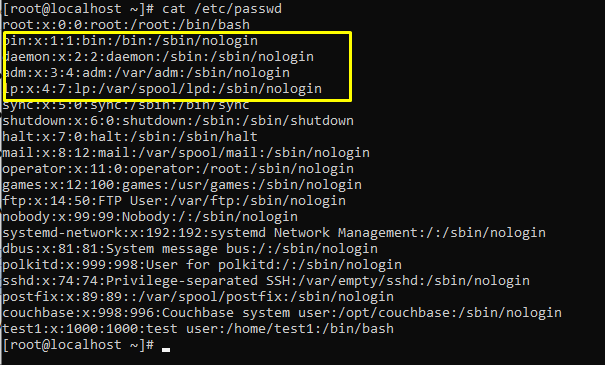

## Local user management

### 1.Giới thiệu về người dùng (http://estih.edu.vn/wp-content/uploads/2017/08/Quan_ly_User.pdf)
#### 1.1.Người dùng là gì? (https://support.maxserver.com/767313--H%C6%B0%E1%BB%9Bng-d%E1%BA%ABn-qu%E1%BA%A3n-l%C3%BD-User-v%C3%A0-Group-tr%C3%AAn-Linux, https://gocit.vn/bai-viet/quan-ly-user-group-va-phan-quyen-tren-linux/)
- User là một thuật ngữ chuyên dụng được sử dụng trong ngành công nghệ thông tin. User được dùng để thể hiện tài khoản của người dùng trong máy tính. User giúp bạn bảo mật thông tin máy tính của bạn. User được sử dụng để login, gán quyền ... Mỗi user còn có một mã định danh riêng gọi là UID. Định danh của người dùng bình thường sử dụng giá trị bắt đầu từ 500.
- Group là thuật ngữ chỉ 1 nhóm tập hợp của nhiều user lại với nhau ,Mỗi user trên linux bắt buộc phải thuộc một group chính (gọi là Primary Group), ngoài ra còn có thể lựa chọn tham gia vào các group khác (gọi là Secondary Group). Mỗi group cũng có một mã định danh riêng gọi là GID. Định danh của group thường được sử dụng giá trị bắt đầu từ 500.

#### 1.2.Phân loại user (https://quantrimang.com/quan-ly-nguoi-dung-trong-unix-linux-157651)
- Superuser: (user gốc) là user có sự điều khiển tuyệt đối tới hệ thống. Một superuser có thể chạy bất kì lệnh nào mà không bị hạn chế. Superuser được coi như là một quản lý hệ thống.
- usersystem: (user hệ thống) là các user được sử dụng cho các hoạt động riêng trong hệ thống như các tài khoản mail, tài khoản sshd. Các user này thường cần cho một số chức năng riêng và nếu có sự thay đổi nào từ chúng cũng sẽ có ảnh hưởng đến dịch vụ của hệ thống.
- regular user: (user thường) là user cung cấp sự truy cập mang tính tương tác tới hệ thống với người dùng và nhóm sử dụng. Các user này thường bị giới hạn truy cập vào những file và thư mục có tính chất quan trọng.

### 2.Quản lí user
#### 2.1.Một số command (https://quantrimang.com/kiem-tra-user-hien-tai-tren-linux-162969, https://cuongquach.com/tim-hieu-khac-biet-su-va-su-minus-linux.html, https://techmaster.vn/posts/34146/co-gi-khac-biet-giua-sudo-va-su-trong-linux)

| Lệnh |    Ý nghĩa    |
|------|---------------|
| whoami | Dùng để cung cấp tên của user hiện tại |
| who | Dùng để cung cấp tên của user hiện tại, thời gian đăng nhập và thiết bị đầu cuối user đăng nhập |
| w | Dùng để cung cấp bộ dữ liệu của user bao gồm tên, loại thiết bị đầu cuối, thời gian login, tên máy chủ từ xa nếu đây là một kết nối từ xa ... |
| id | Cung cấp UID, GID và các nhóm mà user đang là thành viên |
| su | Dùng kết hợp với *username* thì sẽ thực hiện mở một shell mới với quyền của user đó nhưng sẽ không có sự áp dụng các biến môi trường được quy định đối với user đó. |
| su - | Dùng với *username* thì sẽ thực hiện mở shell mới với quyền của user đó nhưng lúc này các biến môi trường được quy định với user đó sẽ được áp dụng đối với shell mới này |
| sudo | Cho phép người dùng có thể sử dụng tài khoản của họ chạy các câu lệnh hệ thống |
| visudo | Dùng để mở chỉnh sửa file */etc/sudoers* |

#### 2.2.File /etc/passwd (https://vinasupport.com/quan-ly-user-group-tren-linux-bang-command-line/, https://blogd.net/linux/quan-ly-nguoi-dung-va-nhom-tren-linux/)
- File /etc/passwd là nơi lưu trữ danh sách và thông tin của các user trong hệ thống.

- Tại đây, thôn tin của 1 user sẽ được thể hiện qua các trường:
`***username:x:UID:GID:comment:Home directory:Default shell***`

#### 2.3.Command useradd và file cấu hình /etc/default/useradd
- Command useradd được dùng để tiến hành tạo user cá nhân và thêm vào hệ thống.
- Cú pháp: `useradd [option] <username>`

- Như ví dụ trên ta tạo user với tên *test1*. Sau khi tạo, ta kiểm tra trong file */etc/passwd* thấy có user *test1* đã được tạo với UID=1000, GID=1000, mô tả thông tin về user, thư mục home được tạo với tên mặc định giống với tên user.

- File /etc/default/useradd là file chứa cấu hình tạo user của hệ thống, ta có thể xem và chỉnh sửa cấu hình tạo user tại file này.

#### 2.4.Command usermod và userdel
- usermod là command được dùng để thay đổi thông tin của user như thay đổi mô tả, thay đổi nhóm của user, thay đổi thư mục home của user ... 

	Ví dụ trên ta đã thay đổi group của user test1 sang group couchbase.

- userdel là command được dùng để xóa user. Sử dụng thêm option `-r` để tiến hành xóa cả thư mục home của user.

#### 2.5.File /etc/skel (https://viblo.asia/p/quan-ly-cac-users-trong-ubuntu-server-p1-lxrzXNApReO)
- File */etc/skel* là file chứa các cấu hình mặc định dành cho một nhóm user nào đó.
Trong thư mục đó sẽ chứa các file cấu hình ẩn như: `.bashrc, .bashrc_profile, ., ..`

- Các file cấu hình đó sẽ được mặc định copy thêm vào thư mục home của user mới khi user đó được tạo.

#### 2.6.User login shell (https://cuongquach.com/su-khac-nhau-giua-login-shell-va-non-login-shell-trong-linux.html)
- Một login shell được khởi tạo sau khi một user login thành công vào hệ thống từ terminal ssh hoặc console. Login shell là tiến trình đầu tiên được thực thi với user ID khi tạo một session mới. Tiến trình login shell sẽ có thêm một dấu gạch ngang ở phía trước để phân biệt và thường bash shell của một shell login sẽ là /bin/bash.

- Một non-login shell được bắt đầu bởi các chương trình như script hay dịch vụ của linux mà không cần phải login tài khoản user. Để phân biệt thì thường một non-login shell sẽ không có dấu gạch ngang ở phía trước và bash shell sẽ là /sbin/nologin

### 3.Quản lí password user

