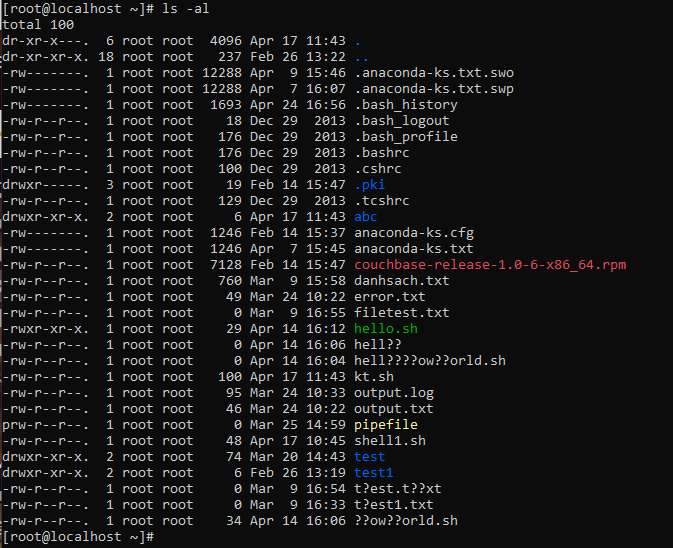
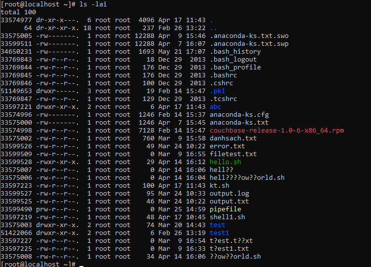
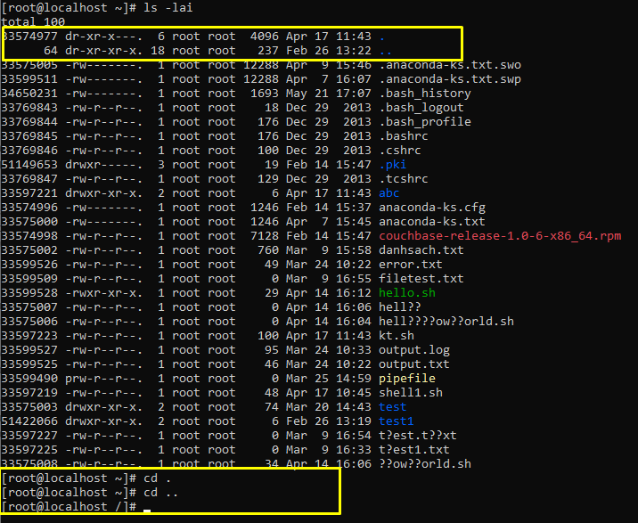
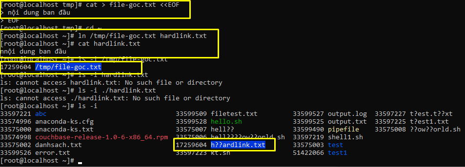
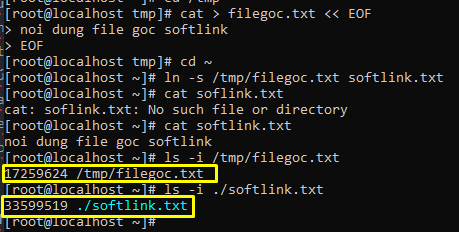
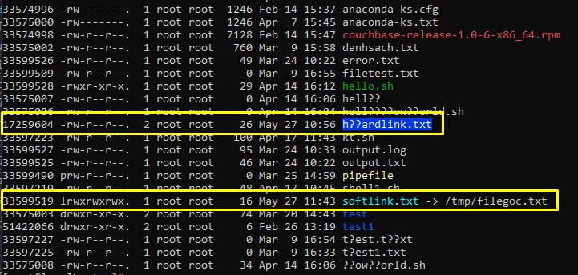

## File security

### 1.Quyền cơ bản trong Linux
#### 1.1.Quyền và phân quyền trong Linux
- Mỗi file trong hệ thống đều có sự quản lí của các owner, các group đã tạo ra chúng. Những thao tác mà các owner, các user có thể tác động đến file đó thì gọi là quyền của user đối với file đó.
- Do trên hệ thống có rất nhiều user và nhiều file vì thế việc phân quyền trên file cho các user là cần thiết để có thể quy định cũng như hạn chế các tác động của những user đến những file mà user đó không được quản lí.
- Phân quyền trên linux là việc cấp quyền cho user có thể đọc, chỉnh sửa hay thực thi file đó trong hệ thống.
#### 1.2.Các loại file trong Linux
- Trong linux các kiểu file sẽ được thể hiện bằng các kí hiệu. Khi ta sử dụng lệnh `ls -l` sẽ thể hiện đầy đủ chuỗi các kí hiệu thể hiện kiểu file, quyền của owner, group, user khác.
- Để thể hiện các loại file khác nhau thì linux sử dụng một số kí hiệu sau đây:
  <ul>
    <li>***-***: regular file</li>
    <li>***d***: directory</li>
    <li>***c***: character device file</li>
    <li>***b***: block device file</li>
    <li>***s***: local socket file</li>
    <li>***p***: named pipe</li>
    <li>***l***: symbolic link</li>
  </ul>

#### 1.3.Quyền sở hữu và truy cập tập tin
- Mỗi file đều được sở hữu bởi user tạo ra nó, user này được gọi là các user owner. Ngoài các user owner thì các file cũng được quản lí bởi các group, các group lúc này cũng đc gọi là các group owner của file. Các user hay group đều có quyền đối với file như quyền read, write, execute và ta có thể hoàn toàn điều chỉnh được các quyền đó với các đối tượng.
- Các quyền cơ bản thường được gán cho các đối tượng là:
  <ul>
    <li>read (quyền đọc): cho phép các đối tượng có quyền mở và xem nội dung của file</li>
    <li>write (quyền ghi): cho phép các đối tượng có quyền tạo và chỉnh sửa nội dung của file</li>
    <li>execute (thực thi): cho phép các đối tượng được phép chạy các file thực thi như các file scripts shell</li>
  </ul>

#### 1.4.Các command chgrp, chown, chmod, umask
- Câu lệnh *chgrp*: dùng để thay đổi nhóm sở hữu của file, khi đó các user trong nhóm đó sẽ có quyền được phân theo group đối với file đó.
- Câu lệnh *chown*: dùng để thay đổi user owner của một file, ta cũng có thể sử dụng `chown` để thay đổi cả user owner và group owner.
- Lệnh *umask*:Umask hoạt động như một tập hợp các quyền mà các ứng dụng không thể thiết lập trên các tệp. Đó là mặt nạ tạo chế độ tệp cho các quá trình và không thể được đặt cho chính các thư mục. Giá trị Mask sẽ "che đi" một số bit trong Base Permission để tạo ra quyền truy cập chính thức cho file (tương tự như cơ chế của subnet mask) Hầu hết các ứng dụng sẽ không tạo các tệp với quyền thực thi được đặt, do đó chúng sẽ có mặc định là 666, sau đó được sửa đổi bằng ô. Để set quyền mặc định cho bất kỳ file nào được tạo, ta sử dụng lệnh *umask [file_mode]*, để xem umask hiện tại, sử dụng câu lệnh mà không truyền vào tham số nào.
- Câu lệnh *chmod*: dùng để thay đổi quyền của các đối tượng đối với file, ta có thể sử dụng lệnh `chmod` để đặt/xóa quyền read, write, execute hoặc một số quyền nâng cao khác của các đối tượng đối với file. Để phân quyền bằng `chmod` thì ta có thể sử dụng 1 trong 2 chế độ phân quyền là theo chế độ tượng trưng và chế độ số.

##### 1.4.1.Chế độ tượng trưng
- Lệnh chmod sử dụng các kí tự toán học để gáng quyền cho tập tin hay thư mục. Chế độ tượng trưng gồm 3 thành phần kết hợp lại thành một chuỗi:
`chmod [tham chiếu][toán tử][quyền] file`
- Tham chiếu được biểu diển bởi các kí tự sau:

| Tham chiếu | Nhóm |       Mô tả       |
|------------|------|-------------------|
| u | Người dùng | Chủ sở hữu file |
| g | Nhóm | Các người dùng thuộc nhóm sở hữu file |
| o | Người dùng khác | Các người dùng không phải chủ sở hữu file cũng không nằm trong nhóm sở hữu file |
| a | Tất cả | Tất cả các loại đối tượng trên |

- Các toán tử dùng trong `chmod`:

| Toán tử | Chức năng |
|---------|-----------|
| + | Thêm quyền vào một file |
| - | Xóa quyền khỏi một file |
| = | Đặt quyền và ghi đè các quyền trước đó |

- Quyền được sử dụng cơ bản:

| Quyền | Chức năng |
|-------|-----------|
| r | quyền đọc |
| w | quyền ghỉ |
| x | quyền thực thi |

##### 1.4.2.Phân quyền theo chế độ số
- Chế độ số cung cấp một cách biểu diễn dễ nhớ hơn cho người dùng và được biểu diễn bằng 4 số bát phân.
- 3 số bên phải là quyền truy cập của chủ sở hữu, nhóm và người dùng khác. Số thứ 4 là từ phải sang trái biểu diễn các cờ đặc biệt setuid, setgid, sticky
- Quyền biểu diễn theo số:

| Số | Quyền | Kí hiệu |
|----|-------|---------|
| 0 | Không cho phép | --- |
| 1 | Thực thi | --x |
| 2 | Viết | -w- |
| 3 | Viết và thực thi | -wx |
| 4 | Đọc | r-- |
| 5 | Đọc và thực thi | r-x |
| 6 | Đọc và viết | rw- |
| 7 | Tất cả | rwx |

### 2.Quyền nâng cao
- Setuid bit: Thiết lập uid cho file để thực thi là để thiết lập người thực thi file khi file được chạy là người sở hữu file đó chứ không phải người thực hiện câu lệnh thực thi file. Khi ta set uid cho một file thì lúc này kí hiệu `S` sẽ được thay thế cho kí hiệu `x`. Để setuid ta sử dụng câu lệnh: `chmod u+s` hoặc để loại bỏ uid ta sử dụng: `chmod u-s`.
- Setgid bit: Thiết lập gid cho file là để đảm bảo các file nằm trong thư mục đó đều thuộc quyền sở hữu của group owner. Giống với setuid, setgid cũng sẽ thực hiện các file bởi nhóm owner chứ không phải là nhóm thực thi câu lệnh. Khi bit gid được set cho thư mục thì các thư mục con, file sẽ có quyền giống với thư mục cha đang chứa nó.
- Sticky bit: Dùng để set quyền xóa hoặc đổi tên file trong các thư mục. Khi quyền này được set cho một file thì lúc này chỉ có người là owner của file đó (hoặc user root) mới có thể xóa hay đổi tên file. Còn lại các user và group khác không phải owner của file đó thì sẽ không thể xóa hay đổi tên của file đó được.

### 3.File link
#### 3.1.Inode là gì?
- Inode (index node) là một khái niệm cơ bản trong Linux filesystem. Mỗi đối tượng của filesystem được đại diện bởi một inode. Chỉ số inode là một cấu trúc dữ liệu trong hệ thống tệp lưu trữ thông tin về một tệp thường, thư mục hay những đối tượng khác của hệ thống tệp tin.
- Các thông tin được lưu trên inode là: loại file, permission, owner, group, size file, thời gian truy cập, thay đổi file, thời gian file bị xóa, số lượng liên kết đến file, thuộc tính mở rộng, danh sách truy cập file. Mỗi inode sẽ được xác định bởi 1 số duy nhất trong hệ thống tệp tin.

#### 3.2.Thư mục trong linux
- Một thư mục là một file đặc biệt với nội dung chứa một danh sách các đối tượng và chỉ số inode tương ứng với các đối tượng đó. Thông thường, thư mục trong linux sẽ nằm trong một cây thư mục có liên kết với nhau.

- `.` và `..` trong thư mục của linux cũng là đại diện cho các thư mục nằm trong thư mục đó. Dấu `.` thể hiện cho chính thư mục mà người dùng đang làm việc hay còn gọi là thư mục hiện hành. Còn dấu thể hiện cho thư mục mẹ của thư mục hiện hành (tức là thư mục lớn đang chứa thư mục mà người dùng đang làm việc tại đó.). Tuy nhiên, trong thư mục `/` (root) thì các thư mục `.` và `..` đều đại diện cho chính thư mục `/` đó. Vì trong cây thư mục, thư mục `/` là thư mục lớn nhất và không còn thư mục nào lớn hơn nó nữa.

#### 3.3.Hard link và soft link
- Hardlink là một bản sao của file gốc với cùng chỉ số inode của file gốc. Khi ta tạo một hardlink thì chỉ số inode của file hardlink mới sẽ được gán cùng giá trị với chỉ số inode của file gốc. Vì cùng chỉ số inode nên cả file hardlink và file gốc sẽ cùng tham chiếu đến một vùng nhớ chứa địa chỉ của dữ liệu do đó 2 file đều có cùng một dữ liệu. Chính vì thế khi thay đổi dữ liệu trên 1 trong 2 file gốc hoặc file hardlink thì dữ liệu trong file còn lại cũng sẽ thay đổi theo.

- Softlink thực chất là một đường link dẫn đến file gốc. Khi ta tạo một file softlink thì hệ thống sẽ tự tạo ra một inode khác để gán cho file softlink này. Inode của file softlink này sẽ chỉ tới vùng nhớ khác chứa địa chỉ để trỏ tới vùng dữ liệu chứa đường dẫn đến file gốc.

- Sự khác nhau giữa hardlink và softlink là:
  <ul>
    <li>hardlink là một bản sao của file gốc và có cùng số inode với file gốc, còn softlink chỉ là đường dẫn đến file gốc và file softlink sẽ có số inode khác với file gốc.
    
    </li>
    <li>hardlink chỉ có thế tạo với file mà không thể tạo hardlink cho thư mục, còn softlink có thể tạo được cho cả file và thư mục</li>
    <li>hardlink chỉ có thể tạo trên cùng một partition với file gốc, còn softlink có thể tạo trên partition khác với partition của file gốc.</li>
    <li>Khi xóa file gốc thì hardlink vẫn tồn tại trên hệ thống và vẫn có giá trị. Còn khi xóa file gốc softlink sẽ bị vô hiệu hóa và không còn giá trị</li>
  </ul>

### 4.Tham khảo
- https://support.maxserver.com/009025-H%C6%B0%E1%BB%9Bng-d%E1%BA%ABn-ph%C3%A2n-quy%E1%BB%81n-t%E1%BA%ADp-tin-v%C3%A0-th%C6%B0-m%E1%BB%A5c-tr%C3%AAn-Linux (1)
- https://quantrimang.com/phan-quyen-truy-cap-file-bang-lenh-chmod-59672 (1)
- https://blog.vietnamlab.vn/2019/11/05/kien-thuc-linux-phan-1-phan-quyen-trong-linux/ (1.1)
- https://blogd.net/linux/phan-quyen-tap-tin/ (1.1)
- https://linuxconfig.org/identifying-file-types-in-linux (1.2)
- https://www.it-swarm.dev/vi/permissions/umask-la-gi-va-no-hoat-dong-nhu-nao/957127534/ (1.4)
- https://viblo.asia/p/cac-cau-lenh-linux-phan-4-permission-Do75443J5M6 (1.4)
- https://sinhvientot.net/phan-quyen-permission-tren-linux/ (1.4)
- https://www.geeksforgeeks.org/setuid-setgid-and-sticky-bits-in-linux-file-permissions/ (2)
- https://linuxconfig.org/how-to-use-special-permissions-the-setuid-setgid-and-sticky-bits (2)
- https://sk4eo.wordpress.com/2012/04/18/tim-hi%E1%BB%83u-v%E1%BB%81-inode-trong-linux-filesystem/ (3.1)
- https://gocit.vn/bai-viet/mot-vai-dinh-nghia-trong-linux/ (3.2)
- http://blog.thiennk.net/2019-02-25/hard-link-vs-symbolic-link-in-linux.html (3.3)
- https://www.ostechnix.com/explaining-soft-link-and-hard-link-in-linux-with-examples/ (3.3)
