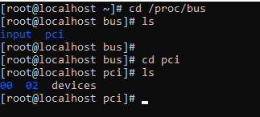
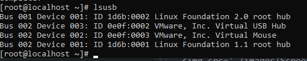
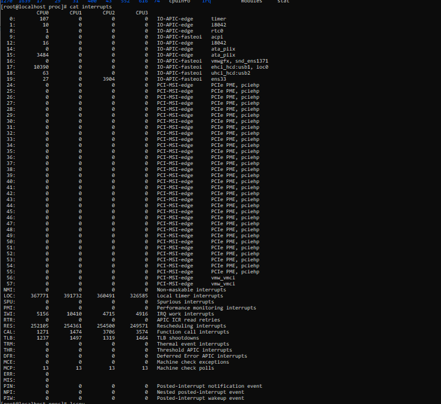
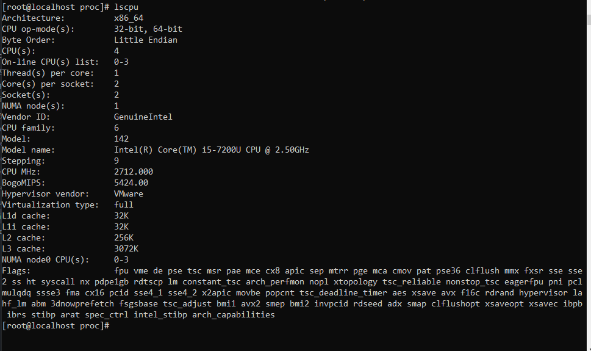
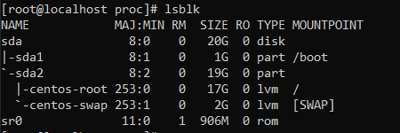
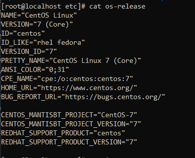
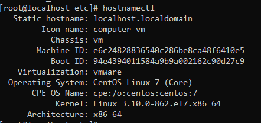
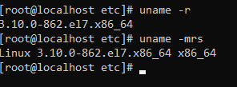

## System info

### 1.File /proc/bus
- Là thư mục chưa thông tin chi tiết vế các luồng giá trị kết nối có sẵn trên hệ thống. Ví dụ như thông tin về các kết cơ bản có sẵn trên hệ thống như các kết nối pci hay usb, các thông tin của mỗi kết nối này sẽ nằm trong một subfolder trong file /proc/bus với tên giống nhau như /proc/bus/pci.
- Những subfolder tồn tại trong /proc/bus sẽ phụ thuộc vào các thiết bị khác nhau kết nối tới hệ thống. Tuy nhiên, với mỗi loại kết nối sẽ có ít nhất một folder, trong mỗi subfolder này lại có ít nhất 1 subfolder với tên được đánh số và nội dung chứa các file nhị phân:

### 2.File /usr/sbin/lsusb
- Là file cấu hình để khởi chạy của lệnh `lsusb`
- Lệnh `lsusb` được sử dụng để hiện thị các kết nối usb tới hệ thống của linux. Khi sử dụng câu lệnh này thì hệ thống sẽ hiện thị ra các kết nối usb đến hệ thống với các thông tin về bus, devices ...

- Nếu trên hệ thống chưa có câu lệnh `lsusb` thì ta có thể tiến hành cài đặt thư viện `usbutils` bằng lệnh `yum install usbutils -y`để có thể chạy được câu lệnh đó.

### 3.File /proc/interrupts
- File `/proc/interrupts` dùng để liệt kê các interrupt xảy ra trong hệ thống cùng với một số thông số liên quan đến các interrupts đó.

### 4.Một số lệnh kiểm tra hệ thống khác
- lscpu: lệnh lscpu được dùng để thể hiện thống tin của cpu đang hoạt động.

- lsblk: dùng để hiển thị các thiết bị lưu trữ và các phân vùng lưu trữ trên các thiết bị lưu trữ đó

- Kiểm tra các phiên bản phân phối có thể sử dụng một số cách
  - Sử dụng lệnh xem nội dung file `cat /etc/os-release`
  

  - Sử dụng lệnh `hostnamectl`
  

  - Sử dụng lệnh `uname -r` hoặc `uname -mrs`
  

### 5.Tham khảo
- https://access.redhat.com/documentation/en-us/red_hat_enterprise_linux/6/html/deployment_guide/s2-proc-dir-bus (1)
- https://ita93.github.io/linux%20device%20driver/Interrupts (3)
- https://quantrimang.com/cach-kiem-tra-phien-ban-linux-166301 (4)
