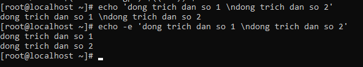
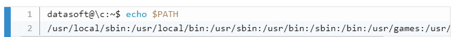

## Commands shell in linux
### 1.Commands and arguments (https://www.w3resource.com/linux-system-administration/commands-and-arguments.php, https://blogd.net/linux/su-dung-tinh-nang-mo-rong-cua-bash-shell/, https://cloudcraft.info/lap-trinh-bash-shell-co-ban-phan-1/)
#### 1.1.Arguments
- Trong linux, một trong các tính năng cơ bản của shell là thực hiện việc quét các dòng lệnh. Khi bạn nhập một command vào giao diện dòng lệnh và nhấn enter thì lúc này Shell sẽ tiến hành quét dòng lệnh đó của bạn, cắt nó thành nhiều phần. Trong khi tiến hành scan dòng lệnh, shell sẽ có các tác động có thể làm nhiều thay đổi đến loại của các đối số. Quá trình này được gọi là shell expansion, và khi quá trình scan này kết thúc cộng với những thay đổi đối với dòng lệnh thì các dòng lệnh đó sẽ được thực thi.
- Các phần của câu lệnh sẽ được ngăn các với nhau bằng một hoặc nhiều khoảng trắng và các phần này được gọi là các arguments. Lúc này các argument sẽ được xóa bỏ các khoảng trắng, argument đầu tiên là lệnh để thực thi, còn các argument phía sau được dùng để chạy lệnh đó.


- Như ví dụ, ta có thể thấy shell đã cắt câu lệnh của chúng ta thành nhiều argument sau đó thực thi argument đầu tiên là lệnh echo để hiển thị thông tin ra màn hình. Các argument tiếp theo là nội dung được dùng để lệnh ***echo*** hiển thị ra. Các argument sau đã được shell cắt bảo các khoảng trắng và chỉ được thêm vào 1 khoảng trắng mới khi hiển thị ra kết quả. Vì thế khi ta có sử dụng 4 câu lệnh với các khoảng trắng ngăn cách là khác nhau nhưng đều cho ra một kết quả giống nhau.

#### 1.2.Single and double quote
- Dấu nháy đơn/Dấu nháy kép (Single quote/Double quote) được sử dụng để ngăn việc loại bỏ khoảng trắng khi shell thực hiện scan các câu lệnh. Khi ta sử dụng các dấu nháy như vậy thì lúc này cụm ở giữa các dấu nháy sẽ được coi là một argument. Ví dụ:


- Sự khác biệt giữa dấu ngoặc đơn và dấu ngoặc kép là:
	<ul>
		<li>Dấu ngoặc kép sẽ loại bỏ ý nghĩa của các kí tự đặc biệt được sử dụng bởi shell tuy nhiên vẫn có một số kí tự đặc biệt mà dấu ngoặc kép không loại bỏ được là "$", "\" và "'". </li>
		<li>Dấu ngoặc đơn sẽ loại bỏ ý nghĩa của tất cả các kí tự đặc biệt</li>
	</ul>


- Các trích dẫn trong dấu nháy có thể bao gồm các kí tự đặc biệt và có thể nhận biết khi ta sử dụng lệnh ***echo*** bằng cách thêm option ***-e*** vào khi ta sử dụng lệnh ***echo***. Ví dụ:



#### 1.3.Các kiểu commands (https://viblo.asia/p/lpic-1-chuong-1-kham-pha-command-line-tren-linux-p-han-1-hieu-biet-can-ban-ve-command-line-aWj53NxYl6m)
- External command là các lệnh không có sẵn trong shell. Khi sử dụng lệnh này, hệ thống sẽ tiến hành đi tìm kiếm đường dẫn trong biến PATH và khởi tạo một 1 process để chạy lệnh đó.
- Builtin command là các lệnh có sẵn trong shell. Khi sử dụng lệnh thì hệ thống không cần phải đi tìm trong biến khác và cũng không sinh ra process nào khác.
- Alias là một cách khai báo nhằm rút gọn câu lệnh, thay vì ta phải nhập toàn bộ câu lệnh để sử dụng được lệnh đó thì ta sẽ gán lệnh đó cho một lệnh ngắn hơn và ta chỉ cần sử dụng câu lệnh ngắn hơn đó để thực thi lệnh mà ta đã gán vào. Thông thường thì các lệnh viết tắt sẽ được lưu trong các thư mục ~/.bashrc và ~/.bash_profile.

#### 1.4.Các lệnh type, which, whereis, whatis (https://cuongquach.com/tim-duong-dan-lenhlinux-bang-whereis-which.html, https://tech.bizflycloud.vn/lam-the-nao-de-tim-duong-dan-tuyet-doi-cua-lenh-tren-linux-bang-whereis-va-which-20180309115725339.htm)
- Type: là lệnh dùng để kiểm tra kiểu của các lệnh thực thi mà ta sử dụng thuộc dạng external hay builtin. Thậm chí ta cũng có thể xem được lệnh đó có phải là một alias hay không. Ví dụ:


- Which: là một câu lệnh dùng để tìm kiếm các file mã nhị phân trong môi trường biến $PATH. Ví dụ:


- Whatis: giống như lệnh ***man*** một câu lệnh giúp đưa ra một mô tả về lệnh mà ta muốn tìm hiểu tuy nhiên ***whatis*** sẽ đưa ra một mô tả ngắn gọn nhất về lệnh đó. Ví dụ:


- Whereis: giống như ***which*** sẽ trả về vị trí của các file mã thực thi của lệnh. Tuy nhiên, ***whereis*** không chỉ trả về vị trí của tập tin thực thi được liệt kê trong biến môi trường $PATH mà nó còn trả về đường dẫn vị trí source code và đường dẫn vị trí trang manual dành cho chương trình hay lệnh đó. Ví dụ:


### 2.Một số kí tự đặc biệt trong shell(https://www.slideshare.net/nguyenvanhung5876060/su-dung-linux-shell-71820899, https://voer.edu.vn/m/lap-trinh-shell-trong-unix/77356e67, https://blogd.net/linux/lap-trinh-bash-shell-sieu-co-ban/)
#### 2.1.Kí tự ";"
- Có tác dụng phân tách nhiều lệnh trên một dòng lệnh. Shell sẽ thực hiện tuần tự các lệnh, thực hiện xong một lệnh trước rồi shell mới thực hiện lệnh tiếp theo. Ví dụ:


#### 2.2.Kí tự "&"
- Có tác dụng chạy một câu lệnh dưới nền và trả lại dấu nhắc hệ thống cho tác vụ khác. Ví dụ:


#### 2.3.Kí tự "$?"
- Có tác dụng trả về trạng thái thoát của lệnh cuối cùng được thực thi. Mặc định, các lệnh khi thực hiện thành công thì sẽ trả về trạng thái thoát là 0 và nếu lệnh thực hiện thất bại thì sẽ trả về trạng thái thoát là 1. Ví dụ:


#### 2.4.Kí tự "|"
- Có tác dụng định hướng dữ liệu output của câu lệnh trước trở thành input của câu lệnh tiếp theo. Ví dụ:


#### 2.5.Kí tự "#"
- Có tác dụng để giúp cho câu lệnh bỏ qua các nội dung được viết phía sau dấu đó. Trong viết shell script thì có tác dụng để tạo ra một comment mô tả trong shell script. Ví dụ:


#### 2.6.Kí tự "\"
- Có tác dụng loại bỏ tác dụng của các kí tự đặc biệt khác như: ;, &, # ... Ví dụ:


#### 2.7.Kí tự "&&"
- Có tác dụng thực hiện một tổ hợp lệnh ```command1&&command2```. Khi lệnh ***command1*** thực hiện xong và trả về giá thị hoàn tất là 0 thì ***command2*** mới được thực hiện. Còn nếu ***command2*** thực hiện bị lỗi thì tổ hợp lệnh sẽ được coi là bị lỗi và không thực hiện được. Ví dụ: 


#### 2.8.Kí tự "||"
- Có tác dụng thực hiện một tổ hợp lệnh ```command1||command2```. Tuy nhiên, chỉ khi nào ***command1*** trả về giá trị thực thi khác 0 thì ***command2*** mới được thực thi. Tổ hợp được coi là bị lỗi nếu tất cả các lệnh đều trả về giá trị thực thi khác 0. Ví dụ:


#### 2.9.Kí tự "\\" đặt ở cuối câu lệnh
- Có tác dụng để chèn thêm nội dung vào nội dung của câu lệnh đó và việc chèn sẽ kết thúc nếu cuối nội dung không còn dấu "\\" nữa. Ví dụ:


### 3.Biến trong Shell
#### 3.1.Gắn biến và gọi biến trong shell (https://viblo.asia/p/bat-dau-voi-lap-trinh-shell-vyDZOQwk5wj, http://nguyenvcuong.blogspot.com/2011/01/shell-script-bien-trong-shell-script.html, http://eslinuxprogramming.blogspot.com/2015/07/shell-command-build-in-shell.html)
- Trong linux shell có 2 kiểu biến:
	<ul>
		<li>Biến hệ thống: được tạo bởi Linux, kiểu biến này thường được viết bằng chữ in hoa</li>
		<li>Biến do người dùng định nghĩa: là biến được đặt và gán giá trị do người dùng tạo.</li>
	</ul>
- Để định nghĩa biến ta sử dụng cú pháp ```tên biến=giá trị biến``` theo đó phải tuân thủ một số quy định như: tên biến bắt đầu bằng kí tự hoặc dấu gạch chân, không có khoảng trắng trước và sau dấu bằng gán giá trị, biến cũng sẽ phân biệt chữ hoa chữ thường, có thể đặt giá trị ***null***, không dùng ```?, *``` để đặt tên biến.
- Sử dụng biến: để truy xuất một giá trị của biến, ta xử dụng cú pháp: $tên_biến. Ví dụ: 


- Lệnh ***set***: dùng để truyền giá trị cho các biến đặc biệt từ $1, $2 ... Ví dụ:


- Lệnh ***unset***: dùng để remove một biến ra khỏi môi trường shell. Ví dụ:


- Lệnh ***export***: dùng để tạo ra một biến môi trường, nhờ vậy mà biến đó có thể được truy cập từ một chương trình hoặc một shell script khác.
- Lệnh ***env***: được dùng để hiển thị các biến đã được export khi không dùng thêm bất kì option nào kèm theo. Ngoài ra, ***env*** cũng có thể được dùng để bắt đầu một shell mới mà sẽ không có sự thừa hưởng những môi trường của shell cũ. Dùng ***env -i*** sẽ xóa sạch môi trường cho các subshell. ***env*** cũng được dùng để đặt biến $LANG hoặc biến khác cho chỉ một phiên bản bash với 1 câu lệnh.

#### 3.2.Loại biến trong shell
- Biến ***$PS1***: được dùng để xác định prompt shell. Bạn có thể sử dụng các dấu gạch ngược và kí tự để đại diện cho các từ đặc biệt ví dụ: ```\u đại diện cho usernames, \w đại diện cho thư mục làm việc```.
- Biến ***$PATH***: 
	<ul>
		<li>được dùng để xác định nơi shell tìm các file thực thi câu lệnh (trừ khi các câu lệnh là dạng builtin hoặc aliased). Biến này sẽ chứa một danh sách đầy đủ các đường dẫn của các thư mục và được ngăn cách bởi dấu 2 chấm.
			</li>
		<li>Shell sẽ không tìm kiếm file thực thi trên thư mục hiện hành. Nếu muốn shell tìm kiếm ở thư mục hiện hành hãy thêm dấu . vào cuối biến $PATH</li>
		<li>Đường dẫn có thể sẽ khác khi sử dụng *su* thay vì *su -* bởi vì đường dẫn sẽ đảm nhận môi trường của người dùng. Người dùng root thường có các thư mục /sbin được thêm vào trong biến $PATH</li>
	</ul>

### 4.Nhúng shell 
- Nhúng shell:
	<ul>
		<li>Shell có thể được nhúng ở trong một câu lệnh hoặc trong văn bản. Trình quét câu lệnh có thể sản sinh ra tiến trình mới có chứa một nhánh của shell hiện tại. Bạn có thể sử dụng biến để chứng thực rằng shell mới đã được tạo.
			</li>
		<li>Bạn có thể nhúng một shell trong một shell nhúng khác, trường hợp này được gọi là vỏ nhúng</li>
	</ul>
- Backsticks: Bạn có thể dùng dấu ` để tránh thay đổi thư mục hiện của bạn ví dụ:

Và bạn không thể sử dụng dấu ` để tạo một vỏ nhúng giống $()

### 5.Shell history
- Nhắc lại câu lệnh vừa sử dụng trong shell ta sử dụng dấu ***!!***. Ví dụ: 


- Bạn cũng có thể nhắc lại các lệnh khác bằng cách sử dụng một dấu ***!*** kết hợp một hoặc một số kí tự để có thể nhắc lại lệnh muốn tìm. Ví dụ:


- Lệnh ***history***: được sử dụng để hiển thị lại lịch sử các lệnh đã sử dụng trong shell. Ví dụ:


- Khi sử dụng ***!*** kết hợp với số thứ tự lệnh mà bạn muốn nhắc lại trong history thì shell sẽ thực hiện lại lệnh đó. Ví dụ:


- Key board ```Ctrl + r```: 