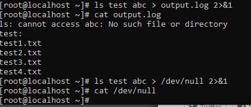

## Pipes and unix basic command tool

### 1.Luồng và điều hướng trong shell
#### 1.1.Các luồng stdin, stdout, stderr (https://spiderum.com/bai-dang/dieu-huong-dau-vao-va-dau-ra-trong-linux-is1)
- ***stdin***: là đầu vào chuẩn, là nơi dữ liệu được nhập vào. Thường dữ liệu sẽ được nhập vào thông qua bàn phím.
- ***stdout***: là đầu ra chuẩn, là nơi trả về các dữ liệu của hệ thống sau khi hệ thống xử lí các thông tin mà người dùng đã đưa vào. Ở đây đầu ra chuẩn thường là terminal.
- ***stderr***: là báo lỗi chuẩn, giống với ***stdout*** thì ***stderr*** thường được hiển thị trên terminal.

#### 1.2.Các điều hướng in, out, error (https://vnsys.wordpress.com/2016/08/05/input-output-redirections-on-linux/, https://quantrimang.com/dieu-huong-io-trong-unix-linux-156633)
- Để điều hướng luồng dữ liệu ta sử dụng dấu ***">"***, ***">>"***, ***"<"***.
- Để điều hướng đầu ra (output) ta sử dụng các cặp dấu ***">"*** hoặc ***">>"*** để có thể điều hướng đầu ra của dữ liệu đến một file thay vì đến terminal. Ví dụ: 

- Để điều hướng đầu vào (input) ta sử dụng dấu ***"<"*** hoặc ***"<<"*** để có thể điều hướng input tiêu chuẩn đến một command. Ví dụ: 

- Điều hướng error dùng để chuyển hướng thông báo lỗi không xuất hiện ra màn hình terminal mà được ghi vào file. Điều hướng lỗi thường được sử dụng khi ta thực hiện một shell script hoặc khi thực hiện một schedule mà không muốn hiện ra thông báo lỗi. Để điều hướng lỗi ta sử dụng ***"2>"*** hoặc ***"2>>"***.

- Trong điều hướng output và error khi ta sử dụng dấu ***>*** thì lúc này luồng dữ liệu điều hướng đến 1 file sẽ thực hiện ghi đè lên dữ liệu cũ trên file đó. Các dữ liệu cũ sẽ bị mất đi. Còn khi ta sử dụng dấu ***>>*** thì luồng dữ liệu khi điều hướng đến file thì dữ liệu mới sẽ được gán thêm vào file đó và được dán tiếp nối các dữ liệu cũ đã có trong file

#### 1.3.Kết hợp điều hướng output và error(https://quantrimang.com/dieu-huong-io-trong-unix-linux-156633, https://techblog.vn/piping-va-chuyen-huong-cau-lenh-trong-linux)
- Để chuyển hướng output ra một tập tin ta có thể sử dụng ***1>*** hoặc ***1>>*** và để chuyển hướng lỗi nếu có ra tập tin ta sử dụng ***2>*** hoặc ***2>>***. Ví dụ:

- Ta cũng có thể chuyển hưởng output và lỗi ra cùng một tập tin thông qua việc sử dụng ***2>&1***. Thông thường, khi sử dụng chuyển hướng output và error ra cùng một tệp tin là để không muốn thông báo hiện lên màn hình làm việc hoặc ta muốn chuyến thông tin đó đến tệp tin đặc biệt /dev/null (là tệp tin mà khi dữ liệu đưa vào đó thì dữ liệu đó sẽ tự động bị loại bỏ.). Ví dụ:

#### 1.4.Điều hướng output với pipe (https://blogd.net/linux/duong-ong-loc-va-chuyen-huong-tren-linux/)
- pipe (đường ống) thường được sử dụng để chuyển hướng output của command trước thành input của command sau.
- Để biểu thị một đường ống ta sử dụng kí hiệu ***"|"***
- Ta có thể thực hiện kết hợp hai hoặc nhiều lệnh cùng một lúc và chạy chúng liên tiếp. Ví dụ:

- ***Đường ống có tên (named pipe)*** có sự hiện diện trong hệ thông tệp hiển thị dưới dạng file, chúng không giống các file thông thường và chúng không có nội dung dù bạn có ghi bao nhiêu dữ liệu vào đó.
- Để thiết lập đường ống có tên ta sử dụng lệnh `*mkfifo*` để tạo ra một file cho đường ống có tên (named pipe). Ví dụ:

- Chúng ta có thể đổ dữ liệu vào đường ống có tên bằng cách chuyển hướng output đến nó. Ví dụ:

- Kế cả ta có đổ liên tục dữ liệu vào đường ống có tên thì độ dài của file vẫn không thay đổi và dữ liệu cũng không bị ghi đè. Ví dụ: 

### 2.Các bộ lọc filter kết hợp với pipe (https://blogd.net/linux/cach-so-sanh-tap-tin-tren-linux/, https://blogd.net/linux/duong-ong-loc-va-chuyen-huong-tren-linux/)
- Các bộ lọc filter thường sử dụng
| grep | Dùng để lọc các dòng văn bản mà phù hợp với điều kiện được đưa vào grep|
| egrep | Tương đương với lệnh *grep -E* |
| cut |  Là lệnh có thể chọn cột trong một file phụ thuộc vào một dâu phân cách. |
| tr | Tìm và thay thế một chuỗi với một chuỗi khác. |
| wc | Đếm ký tự, từ, dòng, byte |
| sort | Sắp xếp dữ liệu |
| sed | Tìm kiếm và thay thế dữ liệu. |
| awk | Tìm kiếm và xử lý file text. |
| uniq | Loại bỏ các dòng trùng nhau. |
| diff | Dùng để so sánh hai file |

### 3.Unix tool
|------|---------------------|
| find | Định vị các file dựa trên các tiêu chí được cung cấp (tên, loại, chủ sở hữu, quyền, kích thước file, v.v...). Trừ khi được cung cấp một vị trí để bắt đầu tìm kiếm, còn nếu không lệnh này chỉ tìm trong thư mục hiện hành. |
| locate | Định vị các file bằng cách sử dụng nội dung của /var/lib/mlocate/mlocate.db được cập nhật bằng lệnh updateb chạy qua cron. Không yêu cầu vị trí bắt đầu. |
| hostnamectl | Dùng để hiển thị thông tin máy hoặc thay đổi lại hostname trong linux |
| timedatectl | Hiển thị thông tin ngày giờ hoặc cài đặt ngày giờ |
| date | Dùng để hiển thị thời gian của hệ thống |
| cal | Hiển thị lịch |
| sleep | Tạo một khoảng thời gian dừng của hệ thống |
| tar | Dùng để nén hoặc giải nén các file |

### 4.Tham khảo
- https://spiderum.com/bai-dang/dieu-huong-dau-vao-va-dau-ra-trong-linux-is1
- https://vnsys.wordpress.com/2016/08/05/input-output-redirections-on-linux/
- https://quantrimang.com/dieu-huong-io-trong-unix-linux-156633
- https://quantrimang.com/dieu-huong-io-trong-unix-linux-156633
- https://techblog.vn/piping-va-chuyen-huong-cau-lenh-trong-linux
- https://blogd.net/linux/duong-ong-loc-va-chuyen-huong-tren-linux/
- https://blogd.net/linux/cach-so-sanh-tap-tin-tren-linux/
