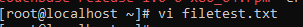
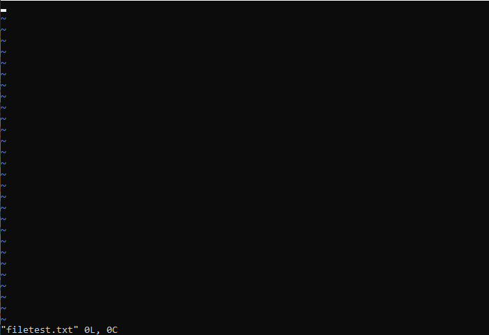

## Use vi basic
### 1.Trình soạn thảo ***"vi"*** trong linux
- ***vi*** là một trình soạn thảo trên linux cung cấp cho người dùng một màn hình cho phép người thực hiện có thể nhìn thấy nội dung file vào chỉnh sửa trực tiếp lên đó.
- ***vi*** được coi là một trình soạn thảo được xem là tiêu chuẩn vì nó thường có sẵn trên các phiên bản của linux, trình thực hiện của nó cũng tương tự như bảng, ***vi*** cũng yêu cầu ít tài nguyên cho nó và nó có cách sử dụng thân thiện hơn các bộ soạn thảo khác.
- Bạn có thể sử dụng Bộ soạn thảo vi để chỉnh sửa một file đang hiện hữu hoặc tạo một file mới từ scratch. Bạn cũng có thể sử dụng Bộ soạn thảo này chỉ để đọc một file văn bản.

### 2.Bắt đầu với trình soạn thảo "vi"
#### 2.1.Thao tác với trình soạn thảo ***vi***
- Bắt đầu khởi chạy ta sẽ sử dụng lệnh ```vi filename``` để có thể mở một file đang tồn tại hoặc để mở một file mới. ví dụ:


- Sau khi mở file bằng ***vi*** ta có giao diện:


- Trong trình soạn thảo ***vi*** có 4 chế độ để người dùng sử dụng:
<ul>
	<li>Normal mode: dùng để chỉnh sửa, sao chép, di chuyển, xóa và thay đổi văn bản. Để vào chế độ normal mode ta sử dụng phím esc</li>
	<li>Insert mode: dùng để update, thay đổi dữ liệu data của file. Để vào chế độ insert mode ta sử dụng phím ```i - I - a - A - o```</li>
	<li>Visual mode: Được sử dụng để lựa chọn một đoạn văn bản. Để thực hiện chế độ này ta sử dụng phím ```v hoặc V```</li>
	<li>Command mode: được sử dụng để lưu, thoát khổi chương trình hoặc dùng để thực hiện tìm kiếm ... Để vào chế độ command sử dụng kí tự ```:```</li>
</ul>

- Thoát khỏi trình soạn thảo ***vi***:
<ul>
	<li>Thoát trình soạn thảo ***vi*** hoặc thoát không lưu lại nội dung hay các chỉnh sửa ta sử dụng ***:q!***</li>
	<li>Thoát và lưu lại các thay đổi nội dung đã chỉnh sửa ta sử dụng ***:wq*** hoặc ***:x***</li>
</ul>

#### 2.2.Thao tác với nội dung trong trình soạn thảo ***vi***
- Di chuyển trong vi:
| Phím |   Công dụng   |
|------|---------------|
| H | Đi sang trái |
| J | Đi xuống |
| L | Đi sang phải |
| K | Đi lên |
| $ | Di chuyển đến cuối dòng |
| ^ hoặc 0 | Di chuyển đến đầu dòng |
| e | Di chuyển về phía trước theo từng từ |
| b | Di chuyển về phía sau theo từng từ |
| gg | Di chuyển về đầu file |
| G | Di chuyển về cuối file |
| ctrl + g | Hiển thị số dòng, cột đang đứng và tổng số dòng của file |
| :set nu | Hiện đánh số dòng |
| :set nonu | Ẩn đánh số dòng |
| :n | Di chuyển về dòng thứ n |

- Bôi đen dòng, đoạn văn bản, toàn bộ file:
| Lệnh |   Công dụng   |
|------|---------------|
| v | Bôi đen dòng, đoạn văn bản tới trước con trỏ đứng |
| V | Bôi đen dòng, đoạn văn bản vị trí con trỏ đứng |
| ggVG hoặc GVgg | Bôi đen toàn bộ file |

- Copy, paste, xóa một dòng hoặc một đoạn văn bản
| Lệnh |   Công dụng   |
|------|---------------|
| yy | Copy dòng hiện tại con trỏ đang đứng |
| nyy | Copy n dòng bắt đầu từ dòng con trỏ đứng kéo xuống dưới |
| p | Paste xuống dưới dòng con trỏ đang đứng |
| P | Paste lên trên dòng con trỏ đang đứng |
| dd | Xóa dòng con trỏ đang đứng |
| ndd | Xóa n dòng từ dòng con trỏ đang đứng kéo xuống dưới |
| x | Xóa kí tự hiện tại con trỏ đang đứng |
| :10,20t20 | Copy từ dòng 10 đến dòng 20 và paste vào dưới dòng 20 |
| u | undo lại thao tác vừa thực hiện |
| ctrl r | redo thao tác vừa thực hiện |

- Tìm kiếm và thay thế:
| Lệnh |   Công dụng   |
|------|---------------|
| /keyword | Tìm kiếm trong file từ vị trí con trỏ xuống dưới |
| ?keyword | Tìm kiếm trong file từ vị trí con trỏ lên trên |
| n | Tiến về phía trước |
| N | Lùi về phía sau |
| :%/old/new/g | Thay thế kí tự *old* thành *new* và có phân biệt chữ hoa chữ thường |
| :%/old/new/gi | Thay thế kí tự *old* thành *new* và không phân biệt chữ hoa chữ thường |

